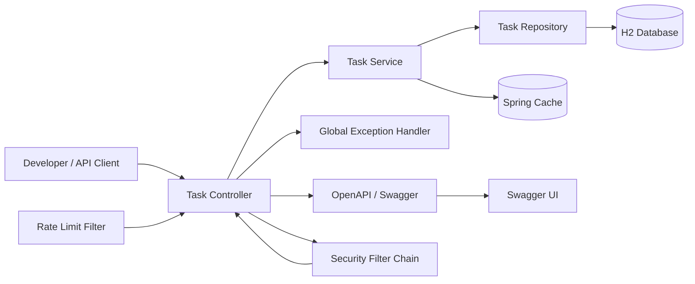
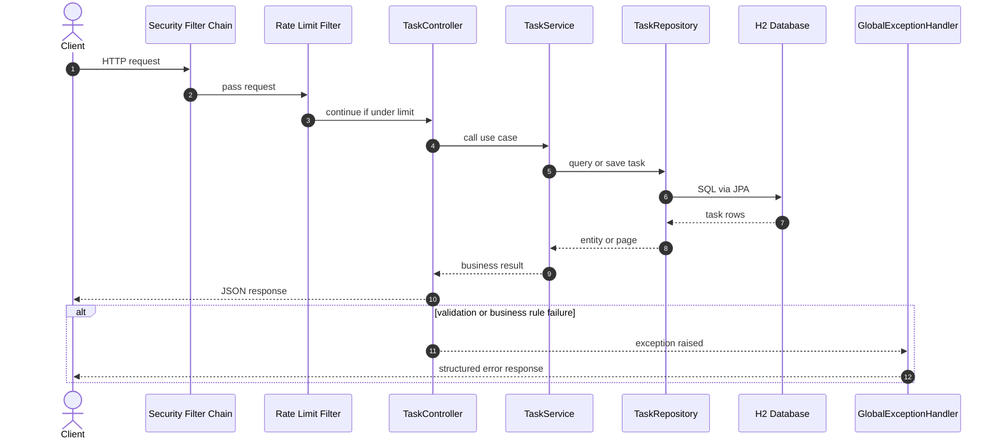
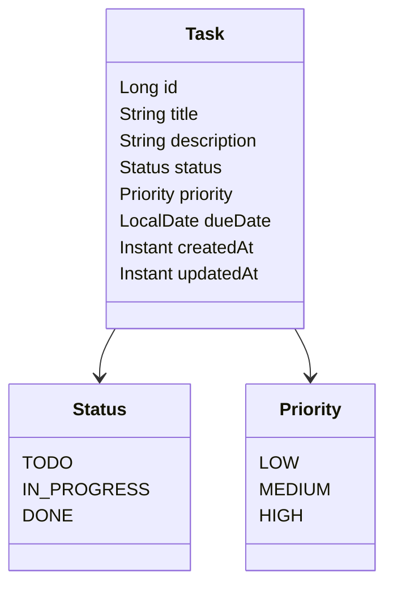
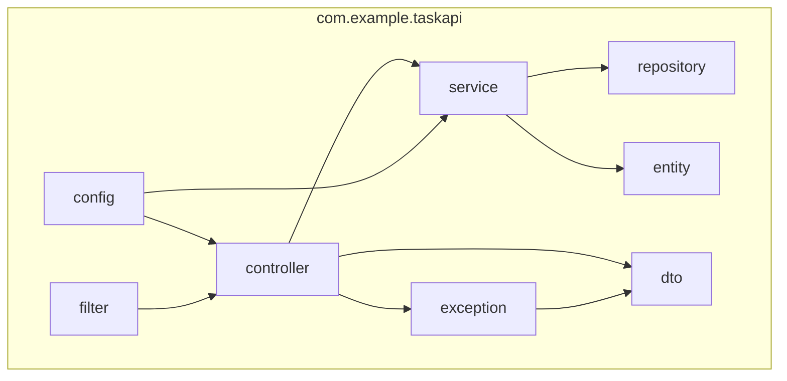
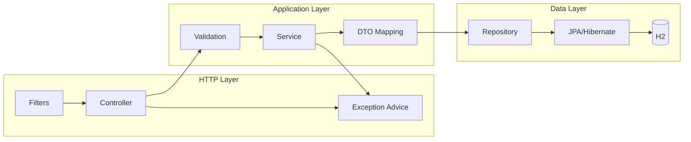

# Spring Boot Task API Architecture

This document summarizes the overall architecture of the Task Management API starter and the completed workshop shape.

## 1. System Overview

## 2. Request Flow

## 3. Domain Model

## 4. Package Structure

## 5. Runtime Responsibilities

